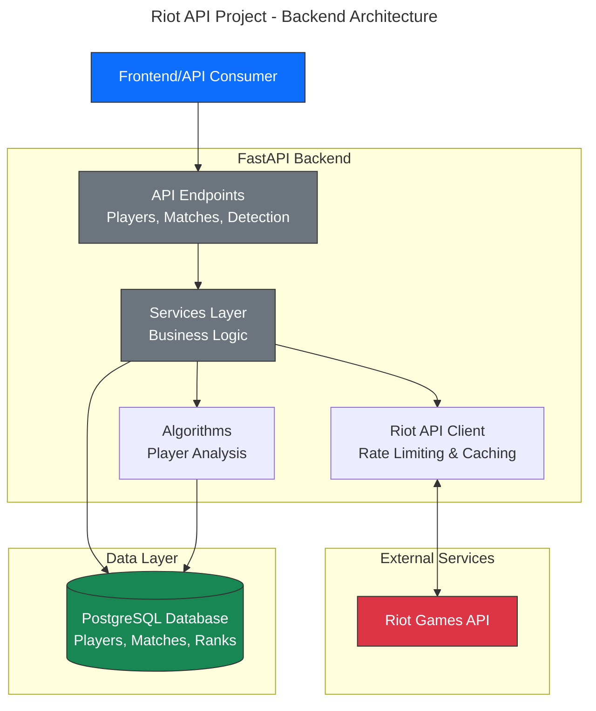
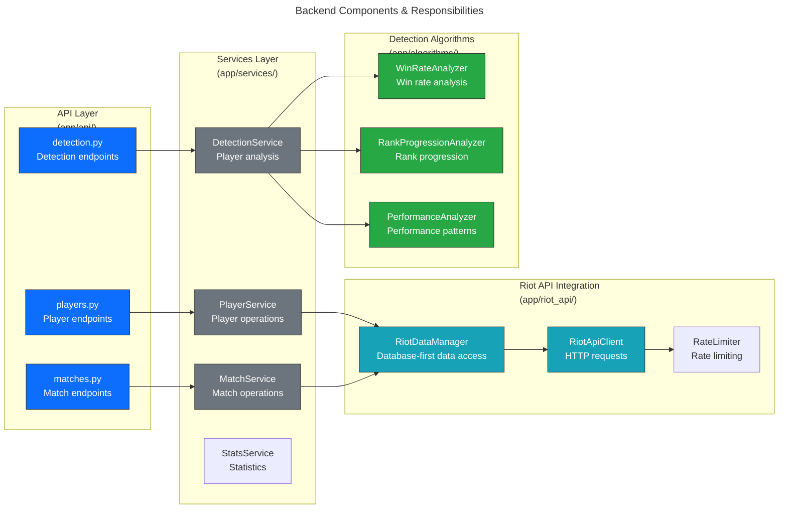
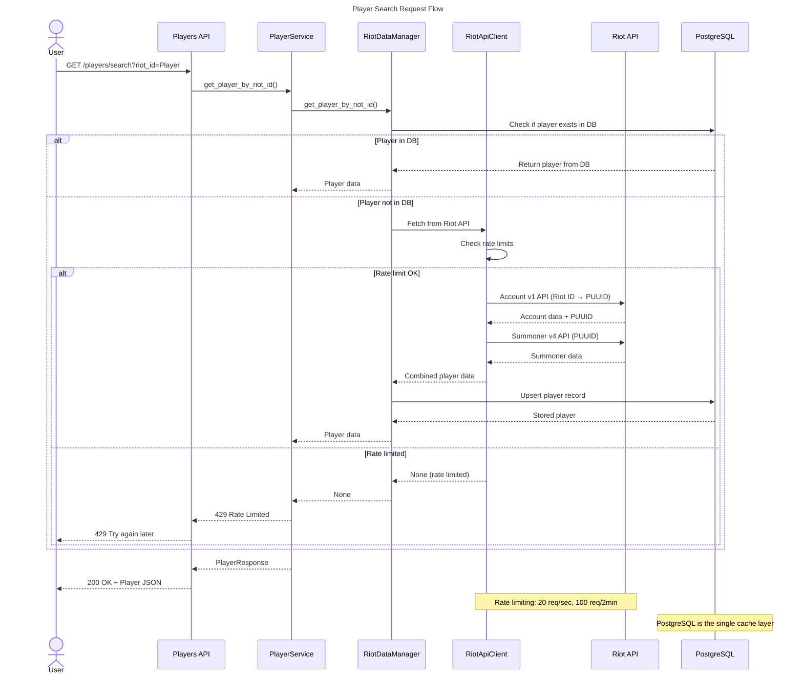
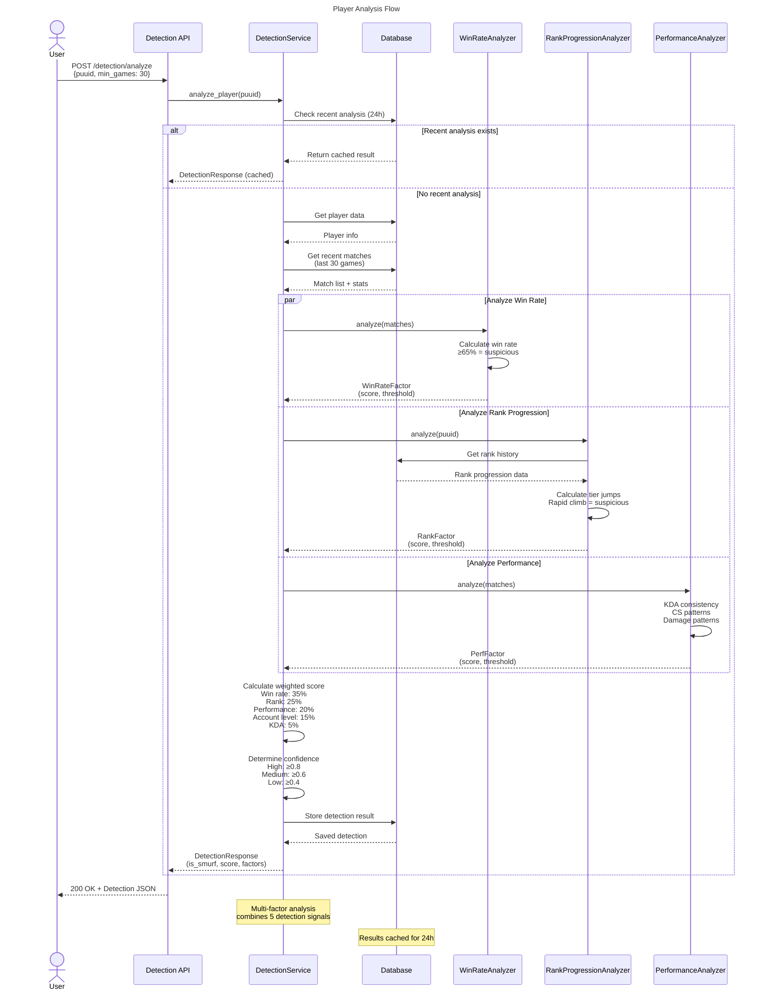
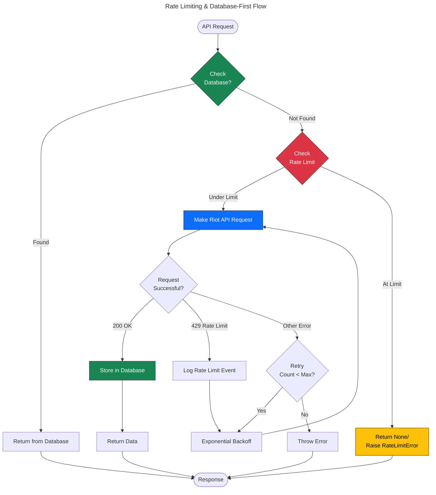
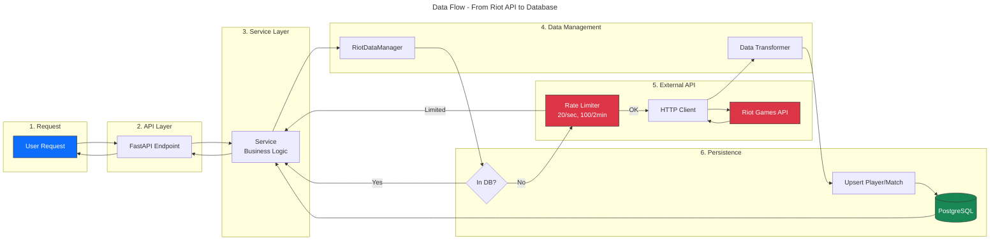
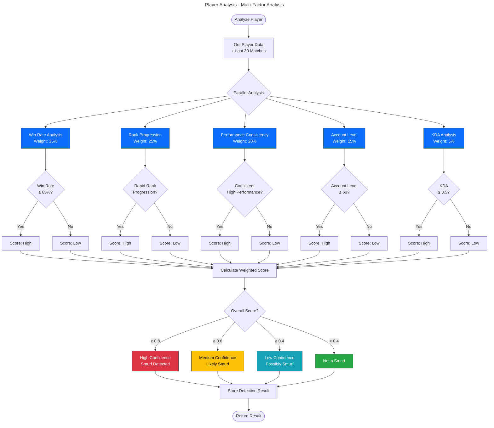

# Backend Architecture Diagrams

This document contains comprehensive diagrams showing how the backend system works together.

## 1. High-Level Architecture

---

## 2. Component Architecture

---

## 3. Player Search Flow

---

## 4. Player Analysis Flow

---

## 5. Rate Limiting & Database Strategy

---

## 6. Data Flow Architecture

## 8. Player Analysis Algorithm

## Summary

These diagrams illustrate:

1. **High-Level Architecture** - Overall system structure
2. **Component Architecture** - Detailed module organization
3. **Player Search Flow** - Complete request/response cycle
4. **Player Analysis Flow** - Multi-factor analysis process
5. **Rate Limiting & Caching** - Performance optimization strategy
6. **Data Flow** - End-to-end data pipeline
7. **Database Schema** - Entity relationships and structure
8. **Detection Algorithm** - Player analysis logic
9. **API Endpoints** - RESTful API structure
10. **Deployment** - Docker container architecture

All components work together to provide efficient player search, match tracking, and intelligent player analysis with robust rate limiting and caching strategies.
