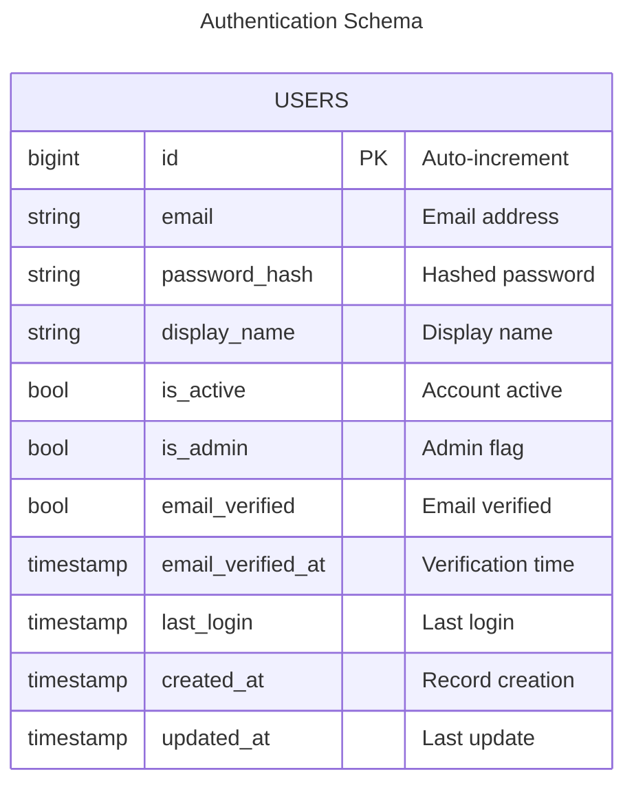
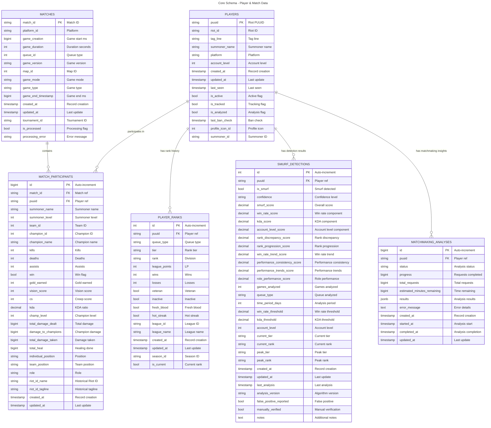
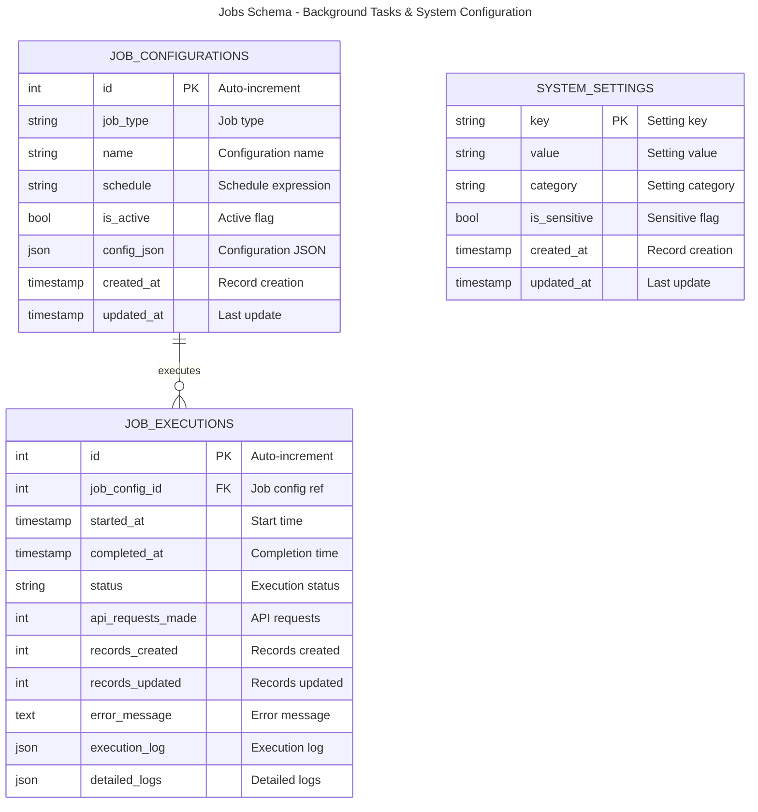

# Database Schema Documentation

PostgreSQL database schema for Riot API project tracking League of Legends players, matches, performance statistics and rankings.

**Database**: PostgreSQL 18
**ORM**: SQLAlchemy with automatic schema creation
**Schemas**: `auth`, `core`, `jobs` (PostgreSQL schema separation)

---

## Entity Relationship Diagram

### Authentication Schema (`auth.*`)



### Core Schema (`core.*`)



### Jobs Schema (`jobs.*`)



---

## Schema Organization

The database is organized into three PostgreSQL schemas for logical separation:

### `auth` Schema

- **Purpose**: User authentication and authorization
- **Tables**: `users`
- **Access**: Admin management, authentication services

### `core` Schema

- **Purpose**: League of Legends game data (players, matches, analyses)
- **Tables**: `players`, `matches`, `match_participants`, `player_ranks`, `smurf_detections`, `matchmaking_analyses`
- **Access**: Main application logic, API endpoints

### `jobs` Schema

- **Purpose**: Background job management and system configuration
- **Tables**: `job_configurations`, `job_executions`, `system_settings`
- **Access**: Job scheduler, admin tools

---

## Table Details

### Auth Schema (`auth.*`)

#### auth.users

**Purpose**: User authentication and authorization for platform access.

**Primary Key**: `id` (BigInt, auto-increment)

**Key Features**:

- Admin-only access initially (via `is_admin` flag)
- Email-based authentication with password hashing
- Email verification workflow support
- Soft account deletion via `is_active` flag
- Activity tracking via `last_login`

**Indexes**:

- `id` (primary key, automatic index)
- `email` (indexed, unique)
- `is_active` (indexed)
- `is_admin` (indexed)
- `last_login` (indexed)
- `created_at` (indexed)

**Relationships**:

- None (standalone for now; future: one-to-many with `core.players` via `linked_accounts` table)

**Future Extensions**:

See `docs/auth-extended.md` for planned OAuth integration, per-user tracked players, and role-based permissions system.

---

### Core Schema (`core.*`)

#### core.players

**Purpose**: Central player registry using Riot's PUUID system.

**Primary Key**: `puuid` (String, 78 characters)

**Key Features**:

- PUUID is immutable (never changes for a player)
- Riot ID (game_name#tag_line) is the modern identifier
- Summoner name can change but is indexed for legacy lookups
- Soft deletion via `is_active` flag
- Last seen tracking for data freshness
- Tracking flags for automated jobs (`is_tracked`, `is_analyzed`)
- Ban status monitoring via `last_ban_check`

**Indexes**:

- `puuid` (primary key, automatic index)
- `riot_id` (indexed)
- `summoner_name` (indexed)
- `platform` (indexed)
- `summoner_id` (indexed)
- `last_seen` (indexed)
- `is_active` (indexed)
- `is_tracked` (indexed)
- `is_analyzed` (indexed)
- `last_ban_check` (indexed)
- Composite: `(summoner_name, platform)`
- Composite: `(riot_id, tag_line)`
- Composite: `(last_seen, is_active)`
- Composite: `(is_tracked, last_seen)`
- Composite: `(is_analyzed, last_ban_check)`

**Relationships**:

- One-to-many with `core.match_participants`
- One-to-many with `core.player_ranks` (historical)
- One-to-many with `core.smurf_detections` (historical)
- One-to-many with `core.matchmaking_analyses` (historical)

---

#### core.matches

**Purpose**: Store match metadata and game information.

**Primary Key**: `match_id` (String, 64 characters)

**Key Features**:

- Match ID format: `{REGION}_{MATCH_NUMBER}` (e.g., `EUN1_3087654321`)
- Timestamps in milliseconds since epoch (Riot API format)
- Queue ID determines match type (420=Ranked Solo, 440=Ranked Flex, etc.)
- Processing flags for player analysis pipeline

**Indexes**:

- `match_id` (primary key, automatic index)
- `platform_id` (indexed)
- `game_creation` (indexed)
- `queue_id` (indexed)
- `game_version` (indexed)
- `game_mode` (indexed)
- `game_type` (indexed)
- `tournament_id` (indexed)
- `is_processed` (indexed)
- Composite: `(platform_id, game_creation)`
- Composite: `(queue_id, game_creation)`
- Composite: `(game_version, game_creation)`
- Composite: `(is_processed, processing_error)`

**Relationships**:

- One-to-many with `core.match_participants`

---

#### core.match_participants

**Purpose**: Link players to matches with detailed performance statistics.

**Primary Key**: `id` (BigInt, auto-increment)

**Foreign Keys**:

- `match_id` → `core.matches.match_id` (CASCADE DELETE)
- `puuid` → `core.players.puuid` (CASCADE DELETE)

**Key Features**:

- Bridge table between players and matches
- Comprehensive performance metrics (KDA, CS, gold, damage, vision)
- Position and role tracking
- Team identification (100=blue, 200=red)
- Summoner name and level snapshot at match time
- Historical Riot ID preservation (riot_id_name, riot_id_tagline)

**Indexes**:

- `id` (primary key, automatic index)
- `match_id` (foreign key, indexed)
- `puuid` (foreign key, indexed)
- `team_id` (indexed)
- `champion_id` (indexed)
- `champion_name` (indexed)
- `individual_position` (indexed)
- `team_position` (indexed)
- `role` (indexed)
- Composite: `(match_id, puuid)` - unique player per match lookups
- Composite: `(champion_id, win)` - champion win rates
- Composite: `(kills, deaths)` - KDA analysis
- Composite: `(individual_position, champion_id)` - role-based champion stats
- Composite: `(team_id, win)` - team performance
- Composite: `(champion_id, kda)` - champion performance analysis
- Composite: `(individual_position, win)` - position win rates

**Relationships**:

- Many-to-one with `core.matches`
- Many-to-one with `core.players`

---

#### core.player_ranks

**Purpose**: Historical rank tracking for progression analysis.

**Primary Key**: `id` (Integer, auto-increment)

**Foreign Keys**:

- `puuid` → `core.players.puuid` (CASCADE DELETE)

**Key Features**:

- Tracks rank over time per queue type
- Supports multiple queue types (Solo, Flex)
- League Points (LP) tracking
- Win/loss statistics per queue
- Special flags (veteran, hot_streak, fresh_blood, inactive)
- `is_current` flag for latest rank

**Rank Tiers** (Enum):

- IRON, BRONZE, SILVER, GOLD, PLATINUM, EMERALD, DIAMOND
- MASTER, GRANDMASTER, CHALLENGER

**Divisions** (Enum):

- I, II, III, IV (not applicable for Master+)

**Queue Types** (Enum):

- RANKED_SOLO_5x5
- RANKED_FLEX_SR
- RANKED_FLEX_TT (deprecated)

**Indexes**:

- `id` (primary key, automatic index)
- `puuid` (foreign key, indexed)
- `queue_type` (indexed)
- `tier` (indexed)
- `rank` (indexed)
- `league_id` (indexed)
- `season_id` (indexed)
- `is_current` (indexed)
- Composite: `(puuid, queue_type)` - player queue lookups
- Composite: `(tier, rank)` - rank distribution analysis
- Composite: `(queue_type, is_current)` - current ranks by queue
- Composite: `(puuid, is_current)` - player's current ranks
- Composite: `(tier, league_points)` - leaderboard queries

**Relationships**:

- Many-to-one with `core.players`

---

#### core.smurf_detections

**Purpose**: Store player analysis analysis results and confidence scores.

**Primary Key**: `id` (Integer, auto-increment)

**Foreign Keys**:

- `puuid` → `core.players.puuid` (CASCADE DELETE)

**Key Features**:

- Multi-component scoring system (9 different detection signals)
- Weighted overall smurf score (0.0-1.0)
- Detection thresholds and parameters
- Historical analysis tracking
- Manual verification and false positive reporting

**Detection Signal Components**:

- Win rate based scoring
- KDA performance scoring
- Account level analysis
- Rank discrepancy detection
- Rank progression tracking
- Win rate trend analysis
- Performance consistency metrics
- Performance trends evaluation
- Role performance analysis

**Detection Signals** (Enum):

- HIGH_WIN_RATE, HIGH_KDA, LOW_ACCOUNT_LEVEL
- RANK_DISCREPANCY, RAPID_RANK_PROGRESSION
- CONSISTENT_HIGH_PERFORMANCE, CHAMPION_POOL_BREADTH
- ROLE_VERSATILITY, UNUSUAL_TIMING_PATTERNS, LOW_NORMAL_GAMES

**Confidence Levels** (Enum):

- LOW, MEDIUM, HIGH, VERY_HIGH

**Indexes**:

- `id` (primary key, automatic index)
- `puuid` (foreign key, indexed)
- `is_smurf` (indexed)
- `confidence` (indexed)
- `smurf_score` (indexed)
- `queue_type` (indexed)
- `last_analysis` (indexed)
- `false_positive_reported` (indexed)
- `manually_verified` (indexed)
- Composite: `(puuid, confidence)` - player detection history
- Composite: `(is_smurf, smurf_score)` - smurf rankings
- Composite: `(queue_type, smurf_score)` - queue-specific analysis
- Composite: `(last_analysis, is_smurf)` - recent detections
- Composite: `(false_positive_reported, is_smurf)` - quality analysis

**Relationships**:

- Many-to-one with `players`

---

#### core.matchmaking_analyses

**Purpose**: Track matchmaking analysis progress and store teammate vs opponent win rate results.

**Primary Key**: `id` (BigInt, auto-increment)

**Foreign Keys**:

- `puuid` → `core.players.puuid` (CASCADE DELETE)

**Key Features**:

- Real-time progress tracking for long-running analyses
- Asynchronous analysis execution with status monitoring
- Time estimation for completion
- JSON-based results storage for flexibility
- Error capture for failed analyses
- Support for cancellation and retry

**Analysis Status** (Enum):

- `pending` - Analysis queued but not started
- `in_progress` - Currently executing
- `completed` - Successfully finished with results
- `failed` - Failed with error message
- `cancelled` - Manually cancelled by user

**Results Structure** (JSON):

- `team_avg_winrate` - Average win rate of teammates (0.0-1.0)
- `enemy_avg_winrate` - Average win rate of opponents (0.0-1.0)
- `matches_analyzed` - Number of matches included in analysis

**Indexes**:

- `id` (primary key, automatic index)
- `puuid` (foreign key, indexed)
- `status` (indexed)
- `created_at` (indexed)
- Composite: `(puuid, status)` - player's active analyses

**Relationships**:

- Many-to-one with `players`

---

#### jobs.job_configurations

**Purpose**: Store job scheduling and configuration settings for automated tasks.

**Primary Key**: `id` (Integer, auto-increment)

**Key Features**:

- Job type enumeration (tracked_player_updater, player_analyzer, matchmaking_analyzer)
- Schedule configuration using cron expressions or intervals
- JSON configuration storage for job-specific parameters
- Active/inactive status management
- Historical execution tracking via relationships

**Job Types** (Enum):

- `tracked_player_updater` - Updates tracked player data
- `player_analyzer` - Analyzes players for smurf detection
- `matchmaking_analyzer` - Performs matchmaking analysis for tracked players

**Indexes**:

- `id` (primary key, automatic index)
- `job_type` (indexed)
- `name` (indexed, unique)
- `is_active` (indexed)
- Composite: `(job_type, is_active)` - active jobs by type
- Unique constraint: `(name)`

**Relationships**:

- One-to-many with `job_executions`

---

#### jobs.job_executions

**Purpose**: Track job execution history, metrics, and detailed logs.

**Primary Key**: `id` (Integer, auto-increment)

**Foreign Keys**:

- `job_config_id` → `jobs.job_configurations.id` (CASCADE DELETE)

**Key Features**:

- Execution timing tracking (start, completion, duration)
- Status monitoring (pending, running, success, failed)
- Performance metrics (API requests, records created/updated)
- Detailed execution logs in JSON format
- Error message capture for debugging

**Status Values** (Enum):

- `pending` - Waiting to run
- `running` - Currently executing
- `success` - Completed successfully
- `failed` - Failed with errors

**Indexes**:

- `id` (primary key, automatic index)
- `job_config_id` (foreign key, indexed)
- `started_at` (indexed)
- `completed_at` (indexed)
- `status` (indexed)
- Composite: `(job_config_id, started_at)` - job execution history
- Composite: `(status, started_at)` - status-based queries

**Relationships**:

- Many-to-one with `job_configurations`

---

#### jobs.system_settings

**Purpose**: Store runtime configuration and system settings.

**Primary Key**: `key` (String, 128 characters)

**Key Features**:

- Key-value configuration storage
- Category grouping for organization
- Sensitive data masking support
- Automatic timestamp tracking
- Runtime configuration management

**Setting Categories**:

- `riot_api` - Riot API configuration
- `jobs` - Job scheduling settings
- `app` - Application configuration

**Indexes**:

- `key` (primary key, automatic index)
- `category` (indexed)
- Unique constraint: `(key)`

---

## Schema Management

Database tables are automatically created on backend startup using SQLAlchemy's `create_all()` method.

### Database Operations

**Initialize Database** (tables created automatically on startup):

```bash
docker compose up backend
```

**Manual Operations** (use Alembic for all schema changes):

```bash
# Apply all migrations (creates/updates tables)
./scripts/alembic.sh upgrade head

# Reset database (WARNING: deletes all data)
./scripts/alembic.sh downgrade base  # Drop all tables
./scripts/alembic.sh upgrade head    # Recreate from migrations

# Alternative: Reset volume completely
./scripts/dev.sh --down
docker volume rm riot-api-project_postgres_data
./scripts/dev.sh  # Migrations auto-run on startup
```

### Model Definitions

All table definitions are in SQLAlchemy models:

- Location: `backend/app/models/`
- Models: `User`, `Player`, `Match`, `MatchParticipant`, `PlayerRank`, `SmurfDetection`, `MatchmakingAnalysis`, `JobConfiguration`, `JobExecution`, `SystemSetting`

**Model Files**:

- `users.py` - User authentication and authorization (future: see `docs/auth-extended.md`)
- `players.py` - Player model with tracking and analysis flags
- `matches.py` - Match metadata and processing flags
- `participants.py` - Match participant performance and historical data
- `ranks.py` - Player rank tracking with tier enums
- `smurf_detection.py` - Enhanced detection with 9 scoring components
- `matchmaking_analysis.py` - Teammate vs opponent win rate analysis
- `job_tracking.py` - Job configuration and execution tracking
- `settings.py` - System settings with sensitive data masking

---

## See Also

- [Extended Auth Schema](/docs/auth-extended.md) - Future OAuth, RBAC, and per-user tracking
- [Docker Guide](/docker/AGENTS.md) - Database operations and container management
- [Backend Guide](/backend/AGENTS.md) - SQLAlchemy models and database interactions
- [Alembic Guide](/backend/alembic/AGENTS.md) - Database migration workflows
