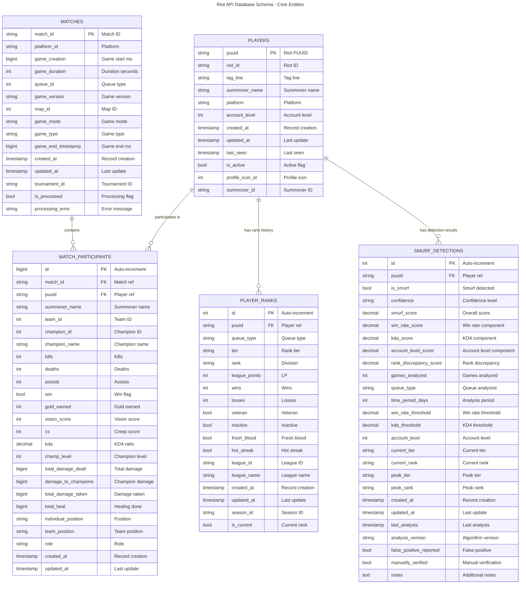
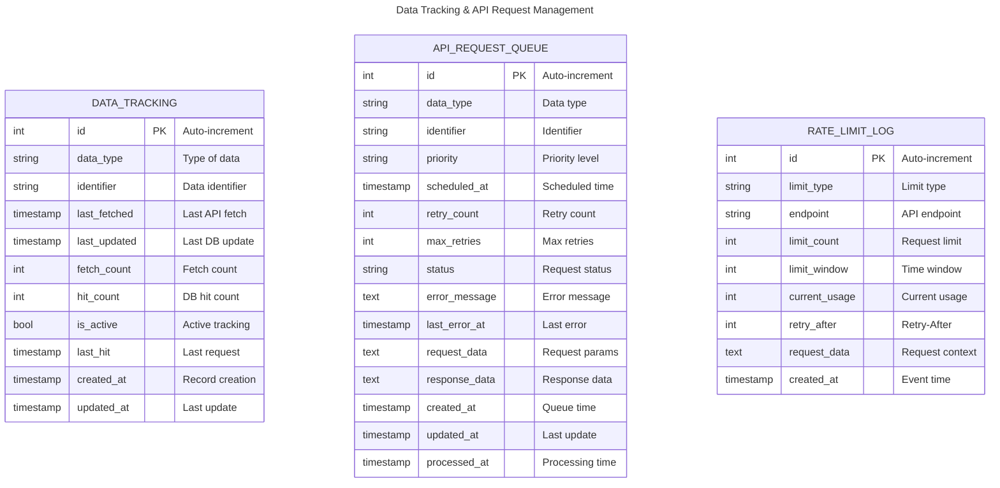

# Database Schema Documentation

PostgreSQL database schema for Riot API project tracking League of Legends players, matches, performance statistics, rankings, and smurf detection.

**Database**: PostgreSQL 18
**ORM**: SQLAlchemy with automatic schema creation

---

## Entity Relationship Diagram

### Core Entities



### Data Tracking & API Management



---

## Table Details

### 1. players

**Purpose**: Central player registry using Riot's PUUID system.

**Primary Key**: `puuid` (String, 78 characters)

**Key Features**:
- PUUID is immutable (never changes for a player)
- Riot ID (game_name#tag_line) is the modern identifier
- Summoner name can change but is indexed for legacy lookups
- Soft deletion via `is_active` flag
- Last seen tracking for data freshness

**Indexes**:
- `puuid` (primary key, automatic index)
- `riot_id` (indexed)
- `summoner_name` (indexed)
- `platform` (indexed)
- `summoner_id` (indexed)
- `last_seen` (indexed)
- `is_active` (indexed)
- Composite: `(summoner_name, platform)`
- Composite: `(riot_id, tag_line)`
- Composite: `(last_seen, is_active)`

**Relationships**:
- One-to-many with `match_participants`
- One-to-many with `player_ranks` (historical)
- One-to-many with `smurf_detections` (historical)

---

### 2. matches

**Purpose**: Store match metadata and game information.

**Primary Key**: `match_id` (String, 64 characters)

**Key Features**:
- Match ID format: `{REGION}_{MATCH_NUMBER}` (e.g., `EUN1_3087654321`)
- Timestamps in milliseconds since epoch (Riot API format)
- Queue ID determines match type (420=Ranked Solo, 440=Ranked Flex, etc.)
- Processing flags for smurf detection pipeline

**Indexes**:
- `match_id` (primary key, automatic index)
- `platform_id` (indexed)
- `game_creation` (indexed)
- `queue_id` (indexed)
- `game_version` (indexed)
- `game_mode` (indexed)
- `game_type` (indexed)
- `tournament_id` (indexed)
- `is_processed` (indexed)
- Composite: `(platform_id, game_creation)`
- Composite: `(queue_id, game_creation)`
- Composite: `(game_version, game_creation)`
- Composite: `(is_processed, processing_error)`

**Relationships**:
- One-to-many with `match_participants`

---

### 3. match_participants

**Purpose**: Link players to matches with detailed performance statistics.

**Primary Key**: `id` (BigInt, auto-increment)

**Foreign Keys**:
- `match_id` → `matches.match_id` (CASCADE DELETE)
- `puuid` → `players.puuid` (CASCADE DELETE)

**Key Features**:
- Bridge table between players and matches
- Comprehensive performance metrics (KDA, CS, gold, damage, vision)
- Position and role tracking
- Team identification (100=blue, 200=red)
- Summoner name snapshot at match time

**Indexes**:
- `id` (primary key, automatic index)
- `match_id` (foreign key, indexed)
- `puuid` (foreign key, indexed)
- `team_id` (indexed)
- `champion_id` (indexed)
- `champion_name` (indexed)
- `individual_position` (indexed)
- `team_position` (indexed)
- `role` (indexed)
- Composite: `(match_id, puuid)` - unique player per match lookups
- Composite: `(champion_id, win)` - champion win rates
- Composite: `(kills, deaths)` - KDA analysis
- Composite: `(individual_position, champion_id)` - role-based champion stats
- Composite: `(team_id, win)` - team performance

**Relationships**:
- Many-to-one with `matches`
- Many-to-one with `players`

---

### 4. player_ranks

**Purpose**: Historical rank tracking for progression analysis.

**Primary Key**: `id` (Integer, auto-increment)

**Foreign Keys**:
- `puuid` → `players.puuid` (CASCADE DELETE)

**Key Features**:
- Tracks rank over time per queue type
- Supports multiple queue types (Solo, Flex)
- League Points (LP) tracking
- Win/loss statistics per queue
- Special flags (veteran, hot_streak, fresh_blood, inactive)
- `is_current` flag for latest rank

**Rank Tiers** (Enum):
- IRON, BRONZE, SILVER, GOLD, PLATINUM, EMERALD, DIAMOND
- MASTER, GRANDMASTER, CHALLENGER

**Divisions** (Enum):
- I, II, III, IV (not applicable for Master+)

**Queue Types** (Enum):
- RANKED_SOLO_5x5
- RANKED_FLEX_SR
- RANKED_FLEX_TT (deprecated)

**Indexes**:
- `id` (primary key, automatic index)
- `puuid` (foreign key, indexed)
- `queue_type` (indexed)
- `tier` (indexed)
- `rank` (indexed)
- `league_id` (indexed)
- `season_id` (indexed)
- `is_current` (indexed)
- Composite: `(puuid, queue_type)` - player queue lookups
- Composite: `(tier, rank)` - rank distribution analysis
- Composite: `(queue_type, is_current)` - current ranks by queue
- Composite: `(puuid, is_current)` - player's current ranks
- Composite: `(tier, league_points)` - leaderboard queries

**Relationships**:
- Many-to-one with `players`

---

### 5. smurf_detections

**Purpose**: Store smurf detection analysis results and confidence scores.

**Primary Key**: `id` (Integer, auto-increment)

**Foreign Keys**:
- `puuid` → `players.puuid` (CASCADE DELETE)

**Key Features**:
- Multi-component scoring system (win rate, KDA, account level, rank discrepancy)
- Weighted overall smurf score (0.0-1.0)
- Detection thresholds and parameters
- Historical analysis tracking
- Manual verification and false positive reporting

**Detection Signals** (Enum):
- HIGH_WIN_RATE, HIGH_KDA, LOW_ACCOUNT_LEVEL
- RANK_DISCREPANCY, RAPID_RANK_PROGRESSION
- CONSISTENT_HIGH_PERFORMANCE, CHAMPION_POOL_BREADTH
- ROLE_VERSATILITY, UNUSUAL_TIMING_PATTERNS, LOW_NORMAL_GAMES

**Confidence Levels** (Enum):
- LOW, MEDIUM, HIGH, VERY_HIGH

**Indexes**:
- `id` (primary key, automatic index)
- `puuid` (foreign key, indexed)
- `is_smurf` (indexed)
- `confidence` (indexed)
- `smurf_score` (indexed)
- `queue_type` (indexed)
- `last_analysis` (indexed)
- `false_positive_reported` (indexed)
- `manually_verified` (indexed)
- Composite: `(puuid, confidence)` - player detection history
- Composite: `(is_smurf, smurf_score)` - smurf rankings
- Composite: `(queue_type, smurf_score)` - queue-specific analysis
- Composite: `(last_analysis, is_smurf)` - recent detections
- Composite: `(false_positive_reported, is_smurf)` - quality analysis

**Relationships**:
- Many-to-one with `players`

---

### 6. data_tracking

**Purpose**: Monitor data freshness and optimize API usage patterns.

**Primary Key**: `id` (Integer, auto-increment)

**Key Features**:
- Tracks when data was last fetched from Riot API
- Monitors database hit rates vs API fetch rates
- Identifies stale data for refresh
- Unique constraint on (data_type, identifier)

**Data Types**:
- `account` - Account/PUUID data
- `summoner` - Summoner information
- `match` - Match details
- `rank` - Ranked data
- `matchlist` - Match history lists

**Indexes**:
- `id` (primary key, automatic index)
- `data_type` (indexed)
- `identifier` (indexed)
- Composite: `(data_type, last_fetched)` - freshness queries
- Composite: `(is_active, last_hit)` - usage patterns
- Unique constraint: `(data_type, identifier)`

---

### 7. api_request_queue

**Purpose**: Queue system for API requests during rate limit periods.

**Primary Key**: `id` (Integer, auto-increment)

**Key Features**:
- Priority-based request scheduling
- Retry logic with configurable max retries
- Status tracking (pending, processing, completed, failed, cancelled)
- Error logging and context preservation

**Priority Levels**:
- `urgent` - User-facing requests
- `high` - Important background tasks
- `normal` - Standard operations
- `low` - Bulk operations

**Status Values**:
- `pending` - Waiting to be processed
- `processing` - Currently being processed
- `completed` - Successfully completed
- `failed` - Failed after retries
- `cancelled` - Manually cancelled

**Indexes**:
- `id` (primary key, automatic index)
- `data_type` (indexed)
- `identifier` (indexed)
- `priority` (indexed)
- `scheduled_at` (indexed)
- `status` (indexed)
- `created_at` (indexed)
- Composite: `(status, priority, scheduled_at)` - queue processing
- Composite: `(scheduled_at, status)` - time-based processing

---

### 8. rate_limit_log

**Purpose**: Log rate limit events for analysis and optimization.

**Primary Key**: `id` (Integer, auto-increment)

**Key Features**:
- Records when rate limits are hit
- Tracks which endpoints cause rate limits
- Stores retry-after durations
- Helps optimize request strategies

**Limit Types**:
- `app` - Application-wide rate limit
- `method` - Method-specific rate limit
- `service` - Service-level rate limit

**Indexes**:
- `id` (primary key, automatic index)
- `limit_type` (indexed)
- `endpoint` (indexed)
- `created_at` (indexed)
- Composite: `(limit_type, created_at)` - temporal analysis

---

## Schema Management

Database tables are automatically created on backend startup using SQLAlchemy's `create_all()` method.

### Database Operations

**Initialize Database** (tables created automatically on startup):
```bash
docker compose up backend
```

**Manual Operations**:
```bash
# Create all tables
docker compose exec backend uv run python -m app.init_db init

# Reset database (WARNING: deletes all data)
docker compose exec backend uv run python -m app.init_db reset

# Drop all tables (WARNING: deletes all data)
docker compose exec backend uv run python -m app.init_db drop
```

### Model Definitions

All table definitions are in SQLAlchemy models:
- Location: `backend/app/models/`
- Models: `Player`, `Match`, `MatchParticipant`, `PlayerRank`, `SmurfDetection`, `DataTracking`, `APIRequestQueue`, `RateLimitLog`

---

## See Also

- [Docker PostgreSQL Guide](/docker/postgres/AGENTS.md) - Database operations and commands
- [Backend Guide](/backend/AGENTS.md) - SQLAlchemy models and database interactions
- [Docker Guide](/docker/AGENTS.md) - Container management and deployment
