# Jobs Documentation

This document describes the automated background jobs that run in the Riot API project to continuously fetch and analyze player data.

## Overview

The system uses two main automated jobs:

1. **Tracked Player Updater** - Updates match history for manually tracked players
2. **Player Analyzer** - Analyzes discovered players for player analysis

Both jobs are managed by APScheduler and use the same base infrastructure for error handling, logging, and metrics collection.

---

# Player Analyzer Job

## 1. Execution Schedule

- **Automated**: Runs on configurable interval (default: 300 seconds)
- **Manual**: Manual execution available through admin interface
- **Condition**: Runs in three phases when there are players needing analysis

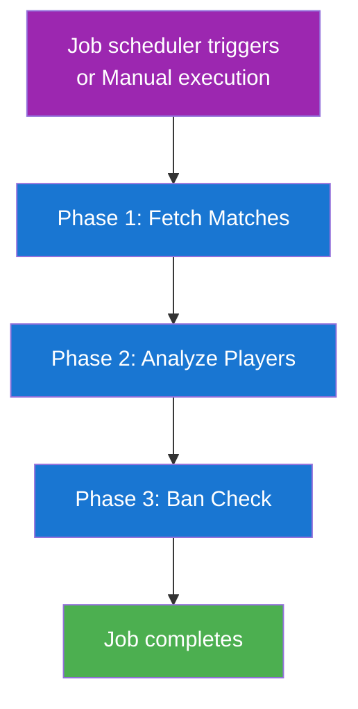

## 2. Workflow

### Phase 1: Fetch Matches

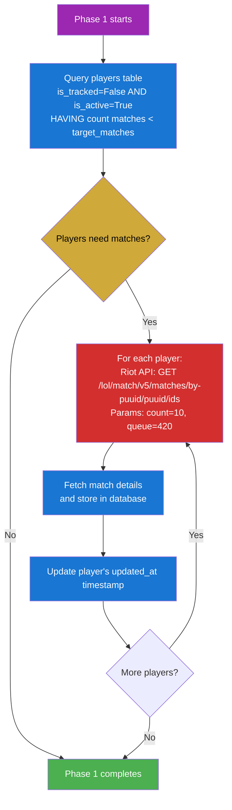

### Phase 2: Analyze Players

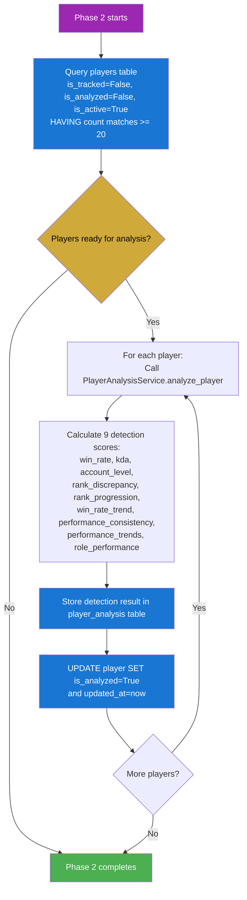

### Phase 3: Ban Check

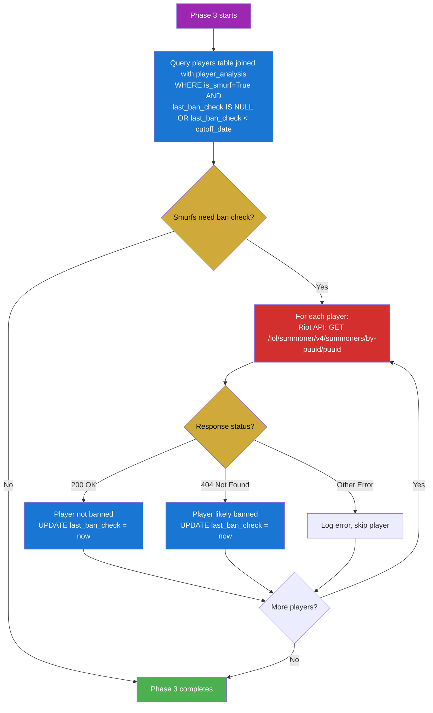

## 3. Success/Failure Handling

### Success Flow

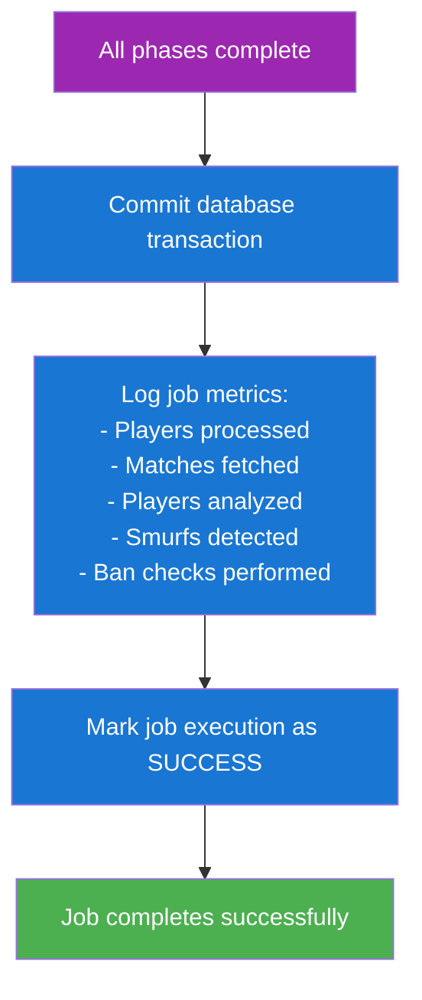

### Failure Flow

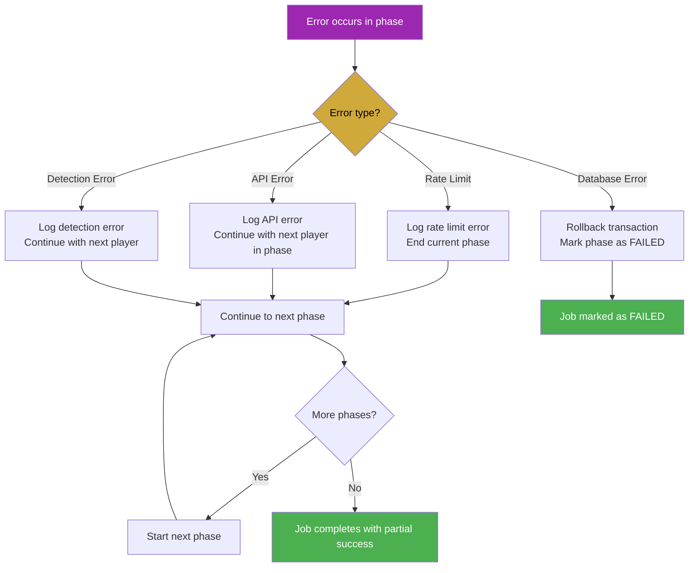

## 4. Database Operations

### Tables Used and Operations

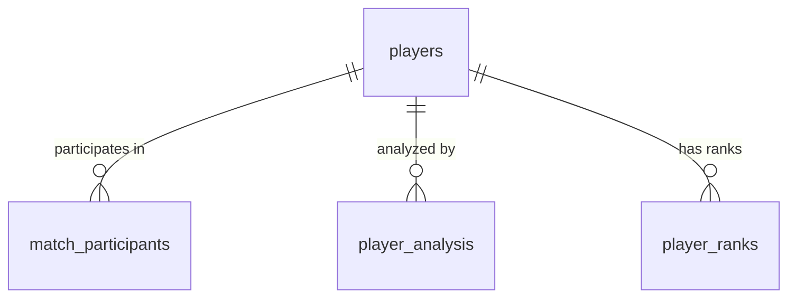

#### **players** table

- **READ**:
  - SELECT players needing matches (insufficient match count)
  - SELECT players ready for analysis (sufficient matches, not analyzed)
  - SELECT smurfs needing ban check (join with player_analysis)
- **UPDATE**:
  - SET `is_analyzed = True` after successful analysis
  - UPDATE `last_ban_check` after ban status verification
  - UPDATE `updated_at` timestamp throughout processing

#### **match_participants** table

- **READ**: COUNT matches per player for eligibility checks

#### **matches** table

- **CREATE**: INSERT new matches fetched during Phase 1

#### **player_analysis** table

- **CREATE**: INSERT new detection results with 9 scoring components

### CRUD Operations Summary

| Operation | Table                      | Purpose                             | Frequency   |
| --------- | -------------------------- | ----------------------------------- | ----------- |
| SELECT    | players                    | Get players needing matches         | Phase 1     |
| SELECT    | players                    | Get players ready for analysis      | Phase 2     |
| SELECT    | players + player_analysis | Get smurfs for ban check            | Phase 3     |
| SELECT    | match_participants         | Count player matches                | Phase 1 & 2 |
| INSERT    | matches                    | Store fetched matches               | Phase 1     |
| INSERT    | player_analysis           | Store analysis results              | Phase 2     |
| UPDATE    | players                    | Mark as analyzed, update timestamps | Phase 2 & 3 |

---

# Tracked Player Updater Job

## 1. Execution Schedule

- **Automated**: Runs on configurable interval (default: 60 seconds)
- **Manual**: Manual execution available through admin interface
- **Condition**: Only when there are players with `is_tracked = True`

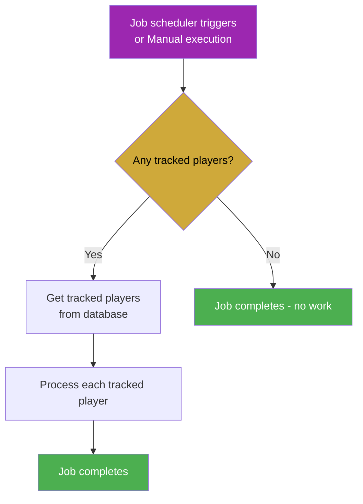

## 2. Workflow

```mermaid
flowchart TD
    A[Job starts] --> B[Query players table<br/>is_tracked=True AND is_active=True]
    B --> C[Get player's last_match_time<br/>from match_participants table]
    C --> D[Calculate fetch start time<br/>based on existing match count]
    D --> E[Riot API: GET /lol/match/v5/matches/by-puuid/puuid/ids<br/>Params: queue=420, startTime, count=100]
    E --> F[Filter match IDs against<br/>existing matches in matches table]
    F --> G{New matches found?}
    G -- Yes --> H[Process each new match]
    G -- No --> M[Update player rank]
    H --> I[Riot API: GET /lol/match/v5/matches/matchId]
    I --> J[Extract participant data<br/>from match response]
    J --> K[Create missing player records in players table<br/>for new participants discovered]
    K --> L[Store match in matches table<br/>and participants in match_participants table]
    L --> M
    M --> N[Riot API: GET /lol/league/v4/entries/by-puuid/puuid<br/>Get ranked stats]
    N --> O[Store rank data in player_ranks table]
    O --> P[Update player's updated_at timestamp]
    P --> Q[SUCCESS: Job completes]

    style A fill:#9c27b0,color:#ffffff
    style B fill:#1976d2,color:#ffffff
    style C fill:#1976d2,color:#ffffff
    style D fill:#1976d2,color:#ffffff
    style E fill:#d32f2f,color:#ffffff
    style F fill:#1976d2,color:#ffffff
    style G fill:#cfa93a,color:#000000
    style I fill:#d32f2f,color:#ffffff
    style J fill:#1976d2,color:#ffffff
    style K fill:#1976d2,color:#ffffff
    style L fill:#1976d2,color:#ffffff
    style N fill:#d32f2f,color:#ffffff
    style O fill:#1976d2,color:#ffffff
    style P fill:#1976d2,color:#ffffff
    style Q fill:#4caf50,color:#ffffff
```

## 3. Success/Failure Handling

### Success Flow

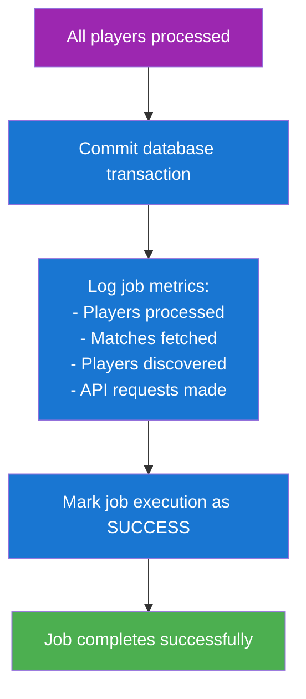

### Failure Flow

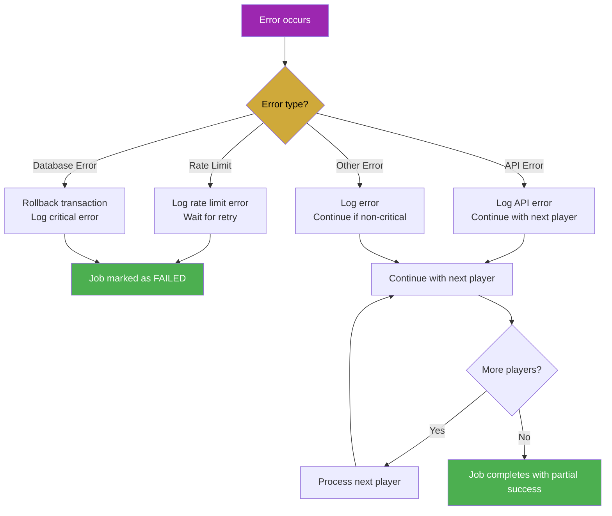

## 4. Database Operations

### Tables Used and Operations

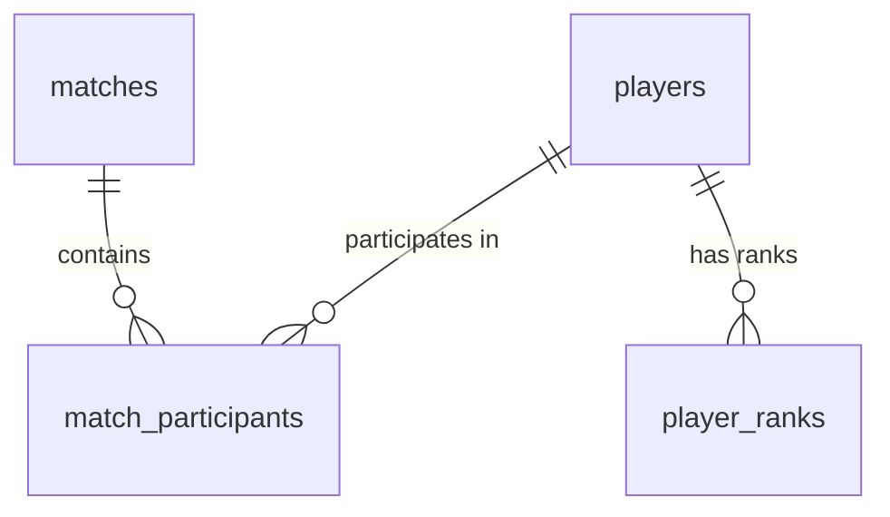

#### **players** table

- **READ**: SELECT players with `is_tracked = True` AND `is_active = True`
- **CREATE**: INSERT new player records for discovered participants (minimal data: puuid, summoner_name, platform, is_tracked=False, is_analyzed=False)
- **UPDATE**: UPDATE `updated_at` timestamp after processing each player

#### **matches** table

- **READ**: SELECT existing match IDs to avoid duplicates
- **CREATE**: INSERT new match records from Riot API data

#### **match_participants** table

- **READ**: SELECT player's match history and timestamps
- **CREATE**: INSERT participant records for each processed match

#### **player_ranks** table

- **CREATE**: INSERT new rank records when player's ranked data changes

### CRUD Operations Summary

| Operation | Table              | Purpose                      | Frequency       |
| --------- | ------------------ | ---------------------------- | --------------- |
| SELECT    | players            | Get tracked players list     | Once per job    |
| SELECT    | match_participants | Get player's last match time | Once per player |
| SELECT    | matches            | Check existing matches       | Once per player |
| INSERT    | players            | Create discovered players    | As needed       |
| INSERT    | matches            | Store new matches            | As needed       |
| INSERT    | match_participants | Store match participants     | As needed       |
| INSERT    | player_ranks       | Store rank updates           | As needed       |
| UPDATE    | players            | Update timestamps            | Once per player |

---

# Job Configuration and Monitoring

## Job Configuration Storage

Job configurations are stored in the **job_configurations** table:

- **job_type**: Enum (`TRACKED_PLAYER_UPDATER` or `PLAYER_ANALYZER`)
- **schedule**: Interval string (e.g., "60", "interval:300")
- **is_active**: Boolean flag to enable/disable jobs
- **config_json**: JSON configuration for job-specific parameters

## Job Execution Tracking

All job executions are logged to the **job_executions** table:

- **job_config_id**: Foreign key to job configuration
- **started_at / completed_at**: Execution timestamps
- **status**: Enum (`PENDING`, `RUNNING`, `SUCCESS`, `FAILED`)
- **api_requests_made**: Number of Riot API calls
- **records_created / records_updated**: Database operation counts
- **error_message**: Error details if failed
- **execution_log**: Detailed JSON log of execution metrics

## Rate Limiting and API Management

Both jobs respect Riot API rate limits:

- **Automatic retry** with exponential backoff on rate limit errors
- **Request counting** to track API usage
- **Error handling** to continue processing when individual requests fail
- **Metrics collection** for monitoring API usage patterns

---

# Important Notes

1. **Database Transactions**: Each job uses database transactions with proper rollback on errors
2. **Error Handling**: Non-critical errors (individual player failures) don't stop the entire job
3. **Rate Limits**: Jobs automatically handle Riot API rate limits with proper retry logic
4. **Idempotency**: Jobs are designed to be safe to run multiple times - they check for existing data before making changes
5. **Resource Management**: Jobs properly clean up API clients and database connections
6. **Logging**: Comprehensive logging with structured logs for debugging and monitoring
7. **Metrics**: Jobs track execution metrics for performance monitoring and optimization
