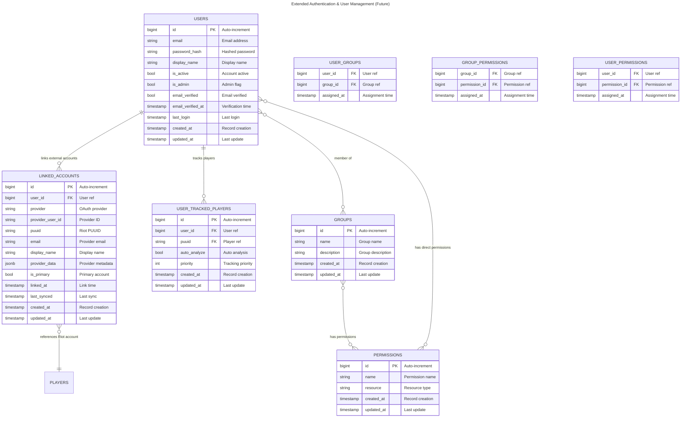

# Extended Authentication Schema

> **⚠️ STATUS: PROPOSED - NOT IMPLEMENTED**
>
> This document describes a **future** extended authentication system for multi-user support.
>
> **Current implementation** only includes basic `auth.users` table.
> See `docs/architecture/database.md` for current schema.
>
> **Related:** See `docs/tasks/technical-debt.md` for planned auth improvements (refresh tokens, account lockout, etc.).

This document describes the planned authentication and authorization system for when the platform opens to public users.

---

## Entity Relationship Diagram



---

## Table Details

### linked_accounts

**Purpose**: Link user accounts to external OAuth providers and Riot accounts.

**Primary Key**: `id` (BigInt, auto-increment)

**Foreign Keys**:

- `user_id` → `users.id` (CASCADE DELETE)
- `puuid` → `players.puuid` (SET NULL, nullable)

**Key Features**:

- Support multiple OAuth providers (Google, Riot, GitHub, etc.)
- One user can link multiple accounts
- Riot account linking stores PUUID for game data access
- Auto-analysis trigger on Riot account connection
- Provider-specific metadata in JSONB

**OAuth Providers** (Enum):

- `google` - Google OAuth 2.0
- `riot` - Riot Games OAuth
- `github` - GitHub OAuth (future)
- `discord` - Discord OAuth (future)

**Indexes**:

- `id` (primary key, automatic index)
- `user_id` (foreign key, indexed)
- `provider` (indexed)
- `provider_user_id` (indexed)
- `puuid` (foreign key, indexed, nullable)
- `linked_at` (indexed)
- Composite: `(user_id, provider)` - user's providers
- Composite: `(provider, provider_user_id)` - unique provider account
- **UNIQUE constraint**: `(provider, provider_user_id)` - prevent duplicate links

**Relationships**:

- Many-to-one with `users`
- Many-to-one with `players` (optional, via puuid)

---

### user_tracked_players

**Purpose**: Per-user player tracking with custom settings.

**Primary Key**: `id` (BigInt, auto-increment)

**Foreign Keys**:

- `user_id` → `users.id` (CASCADE DELETE)
- `puuid` → `players.puuid` (CASCADE DELETE)

**Key Features**:

- Replaces global `is_tracked` flag from `players` table
- Per-user customization of tracked players
- Priority-based ordering for user's player list
- Automatic player analysis on tracked players

**Indexes**:

- `id` (primary key, automatic index)
- `user_id` (foreign key, indexed)
- `puuid` (foreign key, indexed)
- `priority` (indexed)
- `auto_analyze` (indexed)
- Composite: `(user_id, puuid)` - user's tracked player lookup
- Composite: `(user_id, priority)` - user's player list ordering
- **UNIQUE constraint**: `(user_id, puuid)` - user can't track same player twice

**Relationships**:

- Many-to-one with `users`
- Many-to-one with `players`

---

### groups

**Purpose**: Role-based access control groups (admin, moderator, premium, free).

**Primary Key**: `id` (BigInt, auto-increment)

**Key Features**:

- Logical grouping of users by role
- Inherit permissions from group
- Simplifies permission management

**Common Groups**:

- `admin` - Full platform access
- `moderator` - Content moderation access
- `premium` - Premium tier features
- `free` - Free tier users (default)

**Indexes**:

- `id` (primary key, automatic index)
- `name` (indexed, unique)
- `created_at` (indexed)

**Relationships**:

- Many-to-many with `users` (via `user_groups`)
- Many-to-many with `permissions` (via `group_permissions`)

---

### permissions

**Purpose**: Granular permission definitions for access control.

**Primary Key**: `id` (BigInt, auto-increment)

**Key Features**:

- Resource-based permissions (players, matches, analyses, etc.)
- Can be assigned to groups or users directly
- Enables fine-grained access control

**Permission Examples**:

- `view_players` - View player data
- `create_analysis` - Run player analysis
- `unlimited_api_calls` - No rate limiting
- `track_players` - Add players to tracking list
- `view_all_tracked` - See all tracked players (admin)

**Indexes**:

- `id` (primary key, automatic index)
- `name` (indexed, unique)
- `resource` (indexed)
- `created_at` (indexed)
- Composite: `(resource, name)` - resource-specific permissions

**Relationships**:

- Many-to-many with `groups` (via `group_permissions`)
- Many-to-many with `users` (via `user_permissions`)

---

### user_groups (junction table)

**Purpose**: Many-to-many relationship between users and groups.

**Composite Primary Key**: `(user_id, group_id)`

**Foreign Keys**:

- `user_id` → `users.id` (CASCADE DELETE)
- `group_id` → `groups.id` (CASCADE DELETE)

**Indexes**:

- Composite PK: `(user_id, group_id)` - automatic index
- `user_id` (indexed via composite PK)
- `group_id` (indexed via composite PK)
- `assigned_at` (indexed)

---

### group_permissions (junction table)

**Purpose**: Many-to-many relationship between groups and permissions.

**Composite Primary Key**: `(group_id, permission_id)`

**Foreign Keys**:

- `group_id` → `groups.id` (CASCADE DELETE)
- `permission_id` → `permissions.id` (CASCADE DELETE)

**Indexes**:

- Composite PK: `(group_id, permission_id)` - automatic index
- `group_id` (indexed via composite PK)
- `permission_id` (indexed via composite PK)
- `assigned_at` (indexed)

---

### user_permissions (junction table)

**Purpose**: Many-to-many relationship for direct user permission assignment.

**Composite Primary Key**: `(user_id, permission_id)`

**Foreign Keys**:

- `user_id` → `users.id` (CASCADE DELETE)
- `permission_id` → `permissions.id` (CASCADE DELETE)

**Key Features**:

- Override group permissions
- Grant special permissions to specific users

**Indexes**:

- Composite PK: `(user_id, permission_id)` - automatic index
- `user_id` (indexed via composite PK)
- `permission_id` (indexed via composite PK)
- `assigned_at` (indexed)

---

## Authentication Flow (Future)

### JWT Token-Based Auth

**Access Token (JWT)**:

- Short-lived (15 minutes)
- Contains: `user_id`, `is_admin`, `permissions`
- Stateless validation (no DB lookup)
- Stored in memory (not localStorage)

**Refresh Token**:

- Long-lived (7-30 days)
- Random string (not JWT)
- Enables token renewal without re-login
- Can be revoked for security

### OAuth Integration Flow

**1. Sign in with Google:**

```
User → Google OAuth → Callback with google_user_id
  ↓
Check linked_accounts(provider='google', provider_user_id=google_user_id)
  ↓
IF EXISTS: Login to existing user
IF NOT: Create new user + linked_accounts row
```

**2. Connect Riot Account:**

```
User clicks "Connect Riot Account" → Riot OAuth → Get PUUID
  ↓
Create/Update linked_accounts(provider='riot', puuid=<riot_puuid>)
  ↓
Add to user_tracked_players with auto_analyze=true
  ↓
Trigger player analysis job
```

**3. Sign in with Riot (after connection):**

```
Riot OAuth → Get provider_user_id
  ↓
Check linked_accounts(provider='riot', provider_user_id=<id>)
  ↓
Login to user that owns this Riot account
```

---

## Permission Checking

### Permission Resolution Order:

1. Check `is_admin` flag (full access)
2. Check direct user permissions (`user_permissions`)
3. Check group permissions (`group_permissions` via `user_groups`)
4. Deny if no permission found

### Example Permission Checks:

```python
# Check if user can create analysis
def can_create_analysis(user_id: int) -> bool:
    # Admin check
    if users[user_id].is_admin:
        return True

    # Direct permission
    if has_permission(user_id, 'create_analysis'):
        return True

    # Group permission
    for group in user_groups[user_id]:
        if group_has_permission(group.id, 'create_analysis'):
            return True

    return False
```

---

## Migration Path

### Phase 1: Current (Admin-only)

- Only `users` table implemented
- Simple `is_admin` flag for access control
- Email/password authentication

### Phase 2: OAuth Integration

- Add `linked_accounts` table
- Implement Google OAuth
- Implement Riot account linking
- Auto-analysis on Riot connection

### Phase 3: Per-User Tracking

- Add `user_tracked_players` table
- Migrate global tracking to per-user
- Remove `is_tracked` flag from `players`

### Phase 4: Full RBAC

- Add `groups`, `permissions`, junction tables
- Implement permission checking middleware
- Create default groups (admin, premium, free)
- Add rate limiting per permission level

---

## Design Rationale

### Why This Structure?

**Flexible OAuth**: `linked_accounts` supports any provider, easy to add new ones

**Multi-Account Support**: Users can link multiple Riot accounts (track smurfs!)

**Scalable Permissions**: RBAC system scales from simple admin flag to complex enterprise permissions

**Per-User Features**: Each user can track their own players, have custom settings

**Future-Proof**: Easy to add features without schema changes (notifications, premium tiers, etc.)

---

## Column Removal Rationale

### Removed from user_tracked_players:

- ❌ `nickname` - Not needed for MVP, can add later if users request
- ❌ `notify_on_match` - Notifications are Phase 5+ feature
- ❌ `notify_on_rank` - Notifications are Phase 5+ feature

### Removed from groups:

- ❌ `is_system` - Over-engineering, soft delete is sufficient

### Removed from permissions:

- ❌ `action` - Too granular, resource-level is enough for our use case
- ❌ `description` - Permission name is self-documenting
- ❌ `is_system` - Over-engineering, soft delete is sufficient

### Removed completely:

- ❌ `user_sessions` - JWT doesn't need session storage, simpler for MVP

---

## See Also

- [Database Schema](/docs/architecture/database.md) - Current implementation (users table only)
- [Backend Guide](/backend/AGENTS.md) - API patterns and authentication middleware
- [Frontend Guide](/frontend/AGENTS.md) - Auth UI components and protected routes
